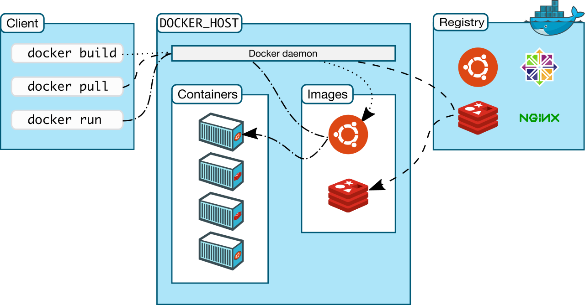

# Docker

[Click here](https://docs.docker.com/get-started/overview/) to get Docker official doc.

Before jump into Docker we have to have little knowledge about [Containers](https://www.ibm.com/cloud/learn/containers) & [Virtual Machines](https://www.ibm.com/in-en/cloud/learn/virtual-machines).

---

What if I told you to share your app (web app) to 100 people ?
They must install all of the frameworks, libraries, languages in order to run your application. This might take some time and effort to do all those things manually.
Question is there has any way to do all those things automatically ? 
The answer is Yes. We can use the concept of containerization. Docker and other tools helps to do that.

# What is Docker ?

Docker helps you to create container to developing, shipping, and running applications so that you can deliver your apllication quickly and easily.
Docker lets you create Dockerfile that may contain your application and all the dependencies needs to run your application. Using that Dockerfile you can create Dockerimage and this lets you create containers. And all of these things ensure that your application will run on all environments.

# What is Container ?

Think of it like a box or a folder that can store your application source code, libraries and all the dependencies that are required to run your application.

# What are Images ?

Images are the blue print of Containers, it lets you decide the structure of the container and what should be inside of the container. Using an Image you can create a container that you can run on your machine.
If you want to share a container with your friend in that case you will not share the actual container but the image.
**In short Image is the blue print and Container is the actual product.**

# What is Dockerfile ?

If you want to create an Image for yourself you will not create an image but a Dockerfile. It is a file that you will create on your machine to build an Image to share.

**In short a Dockerfile helps you create an Image and an Image helps you to create a Container**

# Architecture of Docker

Docker follows the client-server architecture. Here you as a client request for somthing using Docker CLI and Docker will response back to you.

# Basic Docker Commands

` docker run image-name ` Run an image named as image-name if container not present in the Docker Host then pull the image from Docker Hub and then run.

When we run an image say Ubuntu it will run and imediately it will stop, because containers are not like Virtual Machines containers are ment to create for performing a particualr task and them Exit imediately.

`docker run image-name sleep seconds` It says run the image-name image for second and then stop.

`docker run -d image-name` Run an image on the detached mode or in background.

`docker run -it image-name` It will run an image as a interactive terminal like shell. It will not exit untill you wants to exit. It will only work with the images that can be run as a terminal like- ubuntu, fedora etc.

`docker run image-name:version` This version is called Tags in Docker. run command will run the container of latest version as default but if you want to run a particular version then this will help you do that.
` docker pull image-name `  Pull an image from the Docker Hub that is not present in Docker Host.
` docker images ` List all avaliable images in Docker Host.
` docker run -it image-name `
` docker ps ` List all the running containers.
` docker container ls `
` docker exec -it container-id bash `
` docker stop container-id ` Stop a running container.
` docker ps -a ` List all the containers which are running or were running.

`docker ps -l` List all the containers that were created latest.

`docker ps -s` Display the total size of all the running containers. 
` docker rm container-id ` Remove a container from the list permanently.
` docker inspect container-id/container-name `
` docker logs container-id `
` docker container prune -f ` This will remove all stopped containers.

`docker container kill container-id` It wil kill a running container.

`docker container stats container-id` This will display the stats abound resource usage about a container.

`docker container restart` This will restart a container running or stopped.

`docker container remane container-id new-name` Rename a existing container.

`docker container start container-id` Start a stopped container.

`docker container stop container-id` Stop a running container.

`docker contaier pause cotainer-id` Pasue a running container.
` docker run alpine ping url/ip `
` docker run ubuntu echo Hello `
` docker logs --since argument container-id `
` docker rmi image-id/image-name ` Remove a stopped container from the Docker Host. Container have to have stopped.
` docker start container-id `
` docker commit -m "message" container-id new-container-name:new-container-version `
` docker run -it new-container-name:new-container-version `
` docker images -q `
` docker rmi $(docker images -q) -f `

`
FROM image-name
MAINTAINER Biswajit Malakar <mebiswajitmalakar@gmail.com>
RUN command
CMD ["command-name", "argument-that-the-command-is-taking"]
`

` docker login `
` docker build -t new-image-name path-to-that-image `

` Docker-client ---> Docker Daemon ----> containerd ----> shim ---> runc ---> container `